# Actividad: git add y Patrones

### Estructura Inicial del Proyecto

- He creado los siguientes archivos y directorios con los comandos mkdir -p y touch

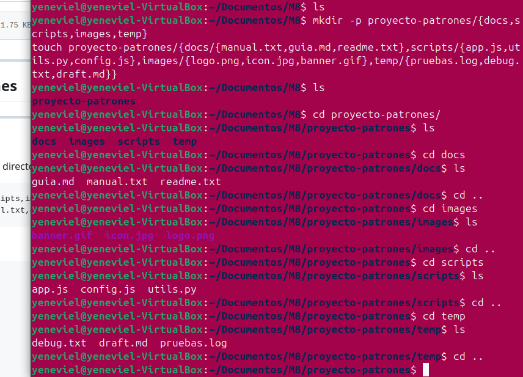

- Inicialización del repositorio con el comando git init

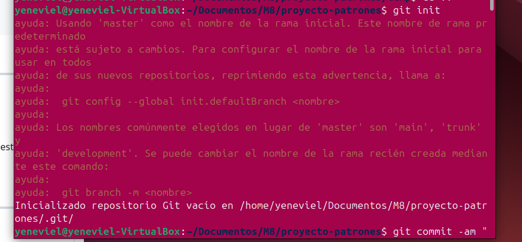

- Con el comando git add se han pasado todos los archivos al staging area
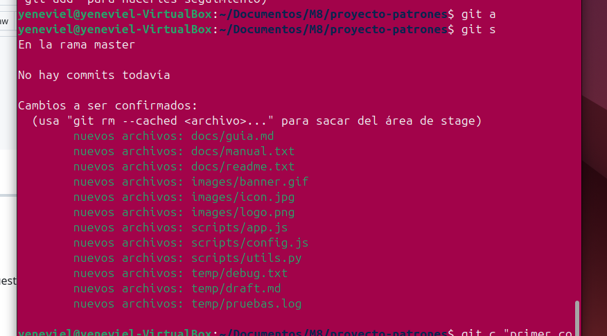

- Primer commit con el comando git commit -m""
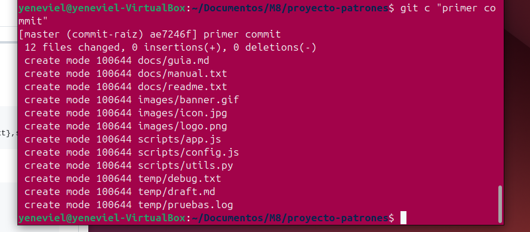

-Con el comando git add docs/*.txt he pasado al staging area todos los archvivos con extension .txt dentro del directorio docs.
Con el alias git s puedo ver el estado de los archivos. 
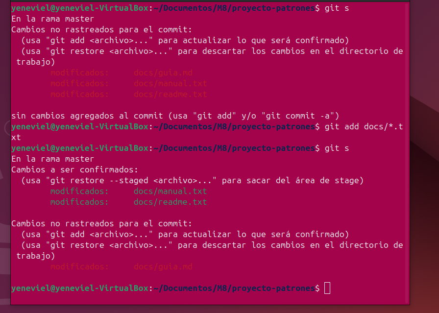

- Commit de los archivos con extension .txt dentro del directorio doc con el alias git (git commit -m "")
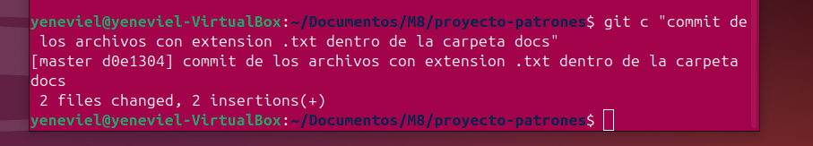

-Con el comando git add scripts/*.js ':!scripts/config.js' he pasado al staging area todos los archivos con extension .js del directorio scripts excepto cnfig.js
Con git s (git status --short) muestro el estado.

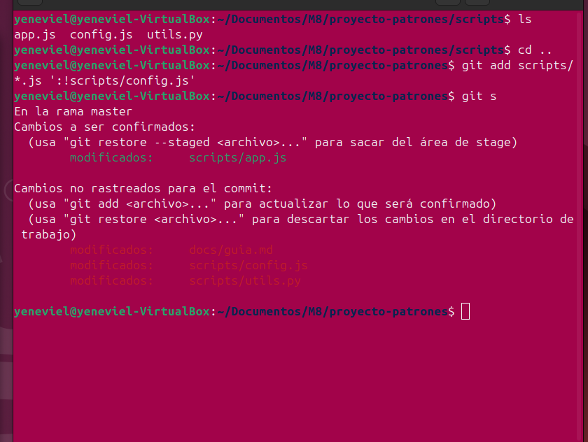

- Commit con el alias git c (git commit -m "")
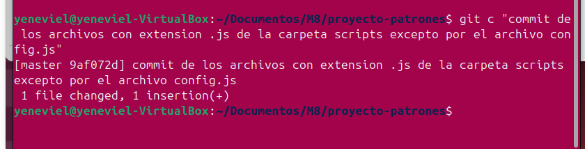

- Con el alias git s puedo mostrar lo arhivs con cambios no rastreaados
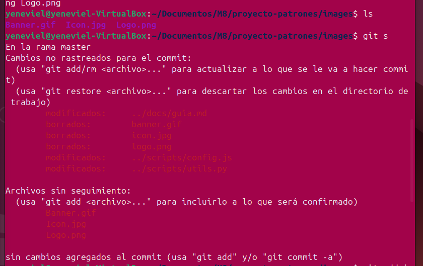

- Con el comando git add images/ ':!images/*.gif' he pasado al taging area todos las imagenes dentro de la crpeta imagenes excepto las que tienen la extensin .gif
Con el alias git  pueo mostrar el estado de los archivos
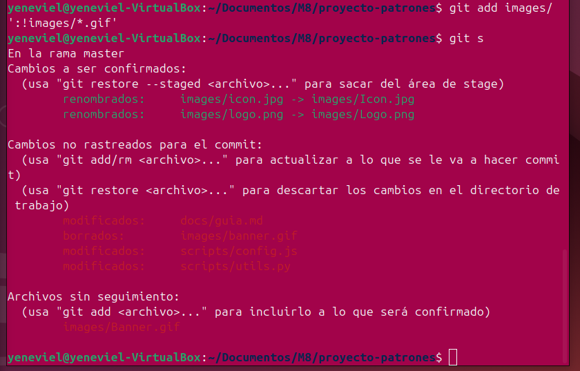

- Con el alias git c he hecho un commit 
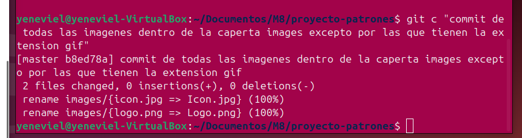

